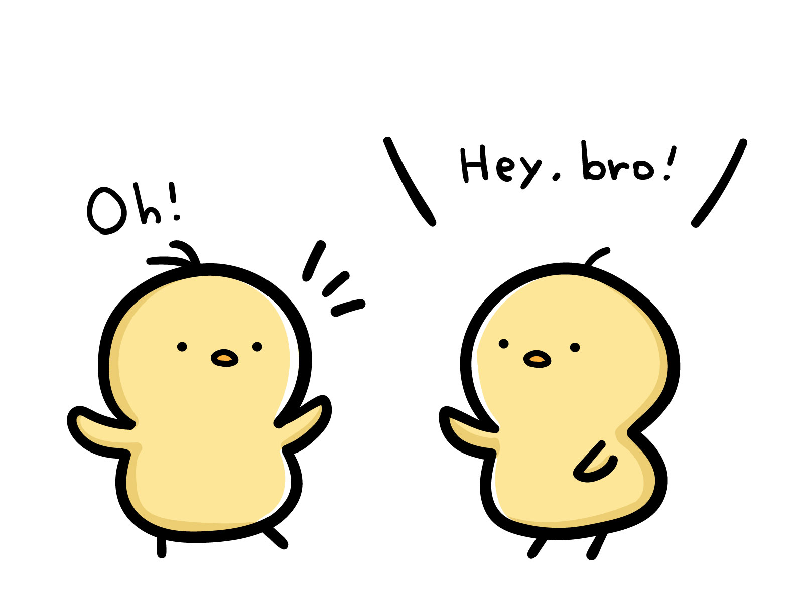
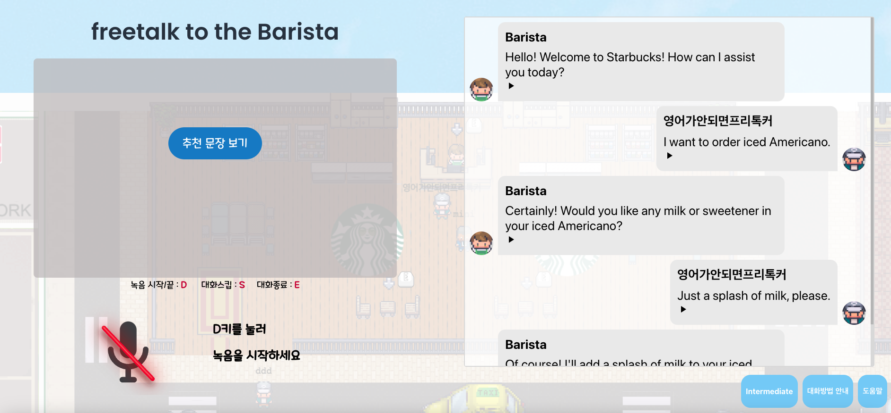
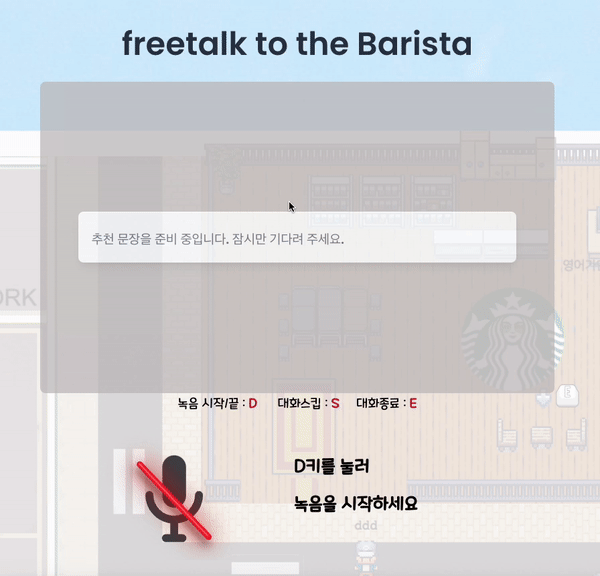
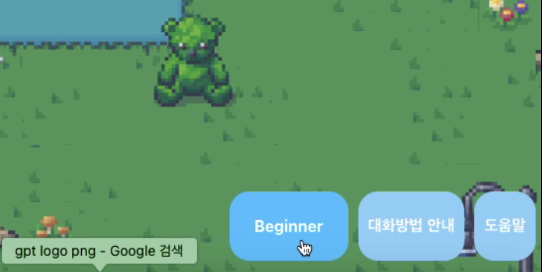
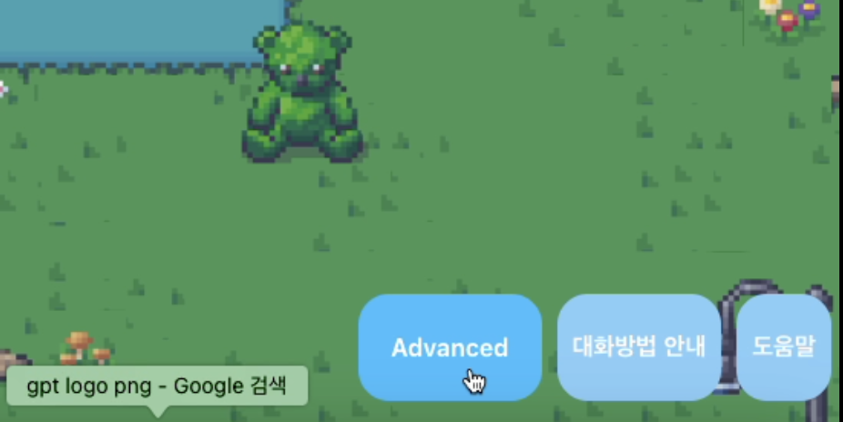
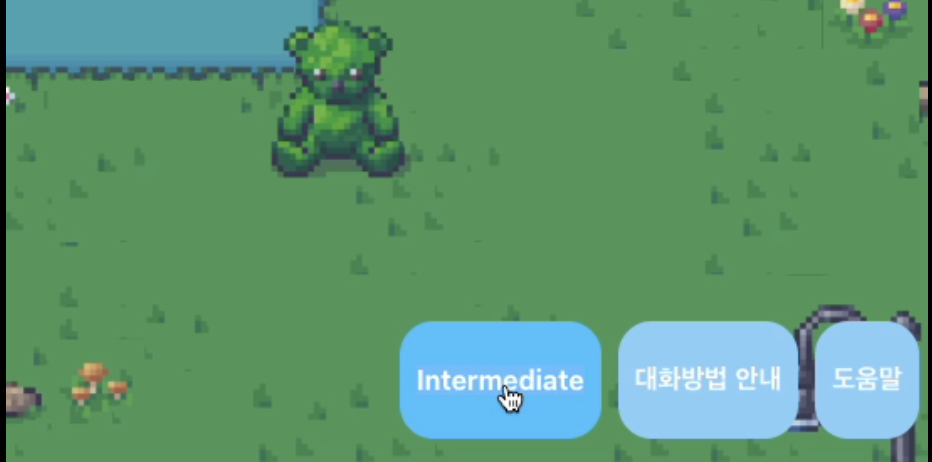
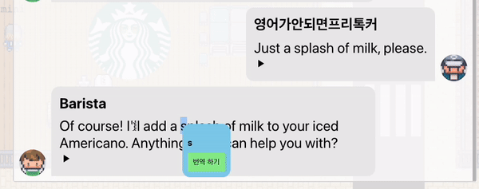
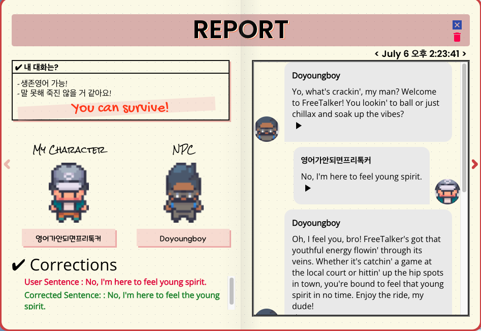
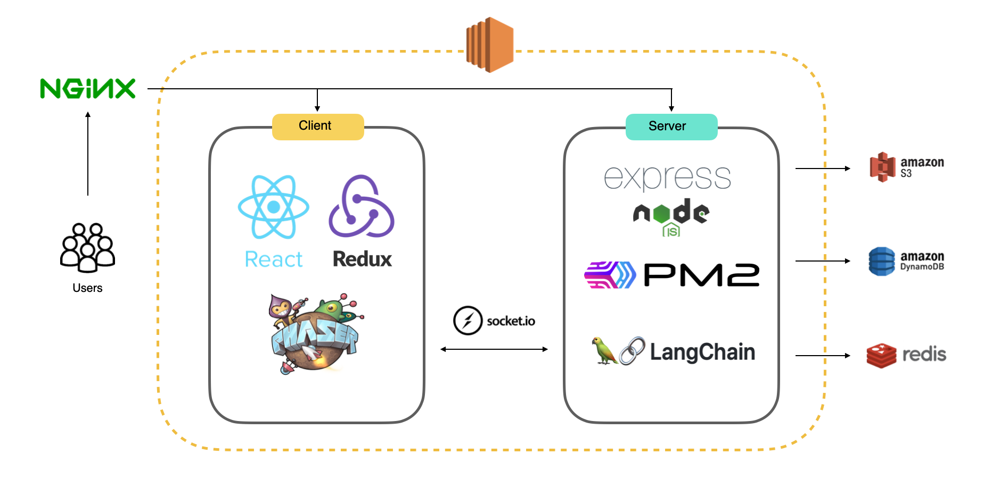
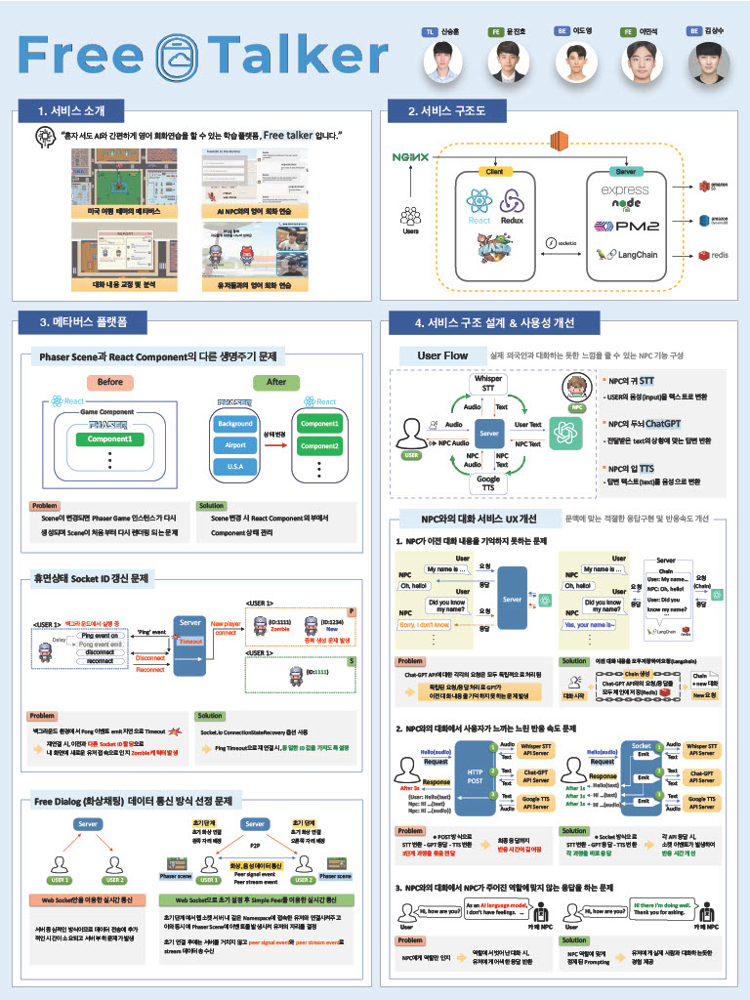

# FreeTalker

## 목차
[1. 프로젝트 개요](#프로젝트-개요)

[2. 서비스 소개](#서비스-소개)

[3. 서비스 아키텍처](#서비스-아키텍처)

[4. 프로젝트 포스터](#프로젝트-포스터)

## ***프로젝트 개요***
프로젝트 기간: 2023.06.01 ~ 2023.07.08(5주)
- [사용방법](./img/HowToPlay.md)
- 로컬 환경에서 사용시 빌드 및 실행 방법

## ***서비스 소개***

## *영어 회화 잘하고 싶은데, 어떻게 연습하지?*
|||
|:---:|:---:|
|*혼자 하는 회화 공부는 지루해*|*외국인과 대화하기엔 부담스러워*|

## *그럼 Free talker 서비스를 사용해봐!*
|||
|:---:|:---:|
|*메타버스에서 지루하지 않게!*|*AI와 회화를 연습한다면?*|
### **기능 설명**
1. 유저들과 실시간으로 동기화되는 메타버스 공간 (공항, 미국 뉴욕 맵)

2. 다양한 AI NPC와의 영어 대화 기능

 

3. NPC의 응답에 대해 적절한 문장 추천 기능

4. NPC의 대화 난이도를 조절할 수 있는 기능

  

5. NPC와의 대화 중 모르는 단어나 문장을 드레그 시 번역해 주는 기능

6. NPC와의 대화 직후 대화 문장을 다시 듣거나 문법교정 평가를 받을 수 있는 평가 레포트 기능

7. 실제 유저와 화상 통화를 하며 영어 회회를 연습할 수 있는 Free talking 기능

8. 실제 유저와 음성 통화를 하며 주어진 상황과 역할에 맞게 상황극을 할 수 있는 Role playing 기능

## ***서비스 아키텍처***

## ***프로젝트 포스터***

