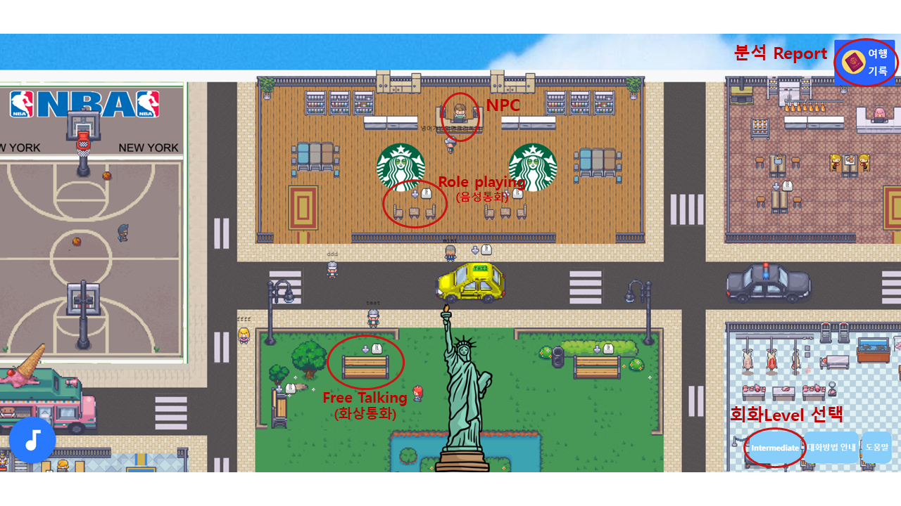
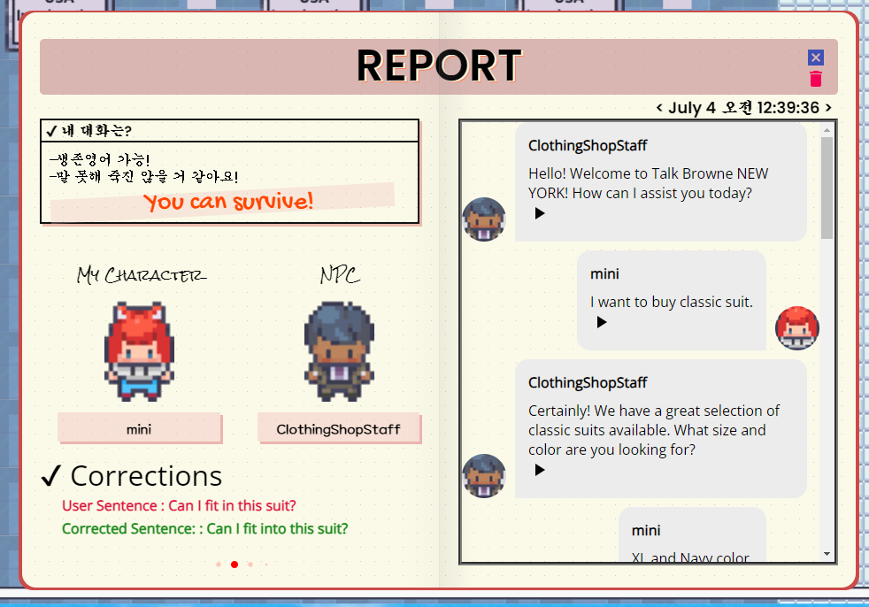

## 사이트 접속
## https://freetalker.site/

# How to play

## NPC 대화

1. 먼저, NPC 근처로 가 **E** 키를 눌러 대화를 시작해보세요.

2. 말을하려면 **D** 키를 눌러 마이크의 상태가 녹음중으로 변하는지 확인하세요.

3. 마이크의 상태가 녹음중으로 변경되면 말을 시작하고, 그만 말하고 싶을때 **D** 키를 눌러 녹음을 중단하세요.

4. 재생되는 NPC의 음성을 그만 듣고 싶으면 **S** 키를 눌러 NPC음성을 스킵하세요.

5. 대화를 그만하고 싶을때 **E** 키를 눌러 대화를 종료하고 Report를 받아보세요.

* NPC의 음성이 재생이 스킵되거나 재생 완료 되기전까지는 **E, D** 키들이 비활성화 됩니다.
* NPC와 대화가 쉽다면 **회화 Level 선택 버튼을** 눌러 난이도 조절이 가능 합니다.
  
## Free talking / Role playing
1. 상호작용이 가능한 구역 근처로 가 E 키를 눌러 다른 User와 대화를 시작해 보세요
2. 대화 구역에 두명의 유저가 입장하면 통화가 가능하고, 통화 버튼을 눌러 통화가 가능합니다.
3. 통화 종료 버튼을 누르면 맵으로 돌아갑니다.

## Report
**여행기록** 버튼을 누르면 이전 Report 확인이 가능합니다.

### Report 에서는 이전 NPC 대화내용과 교정된 문법을 확인할 수 있습니다. 
